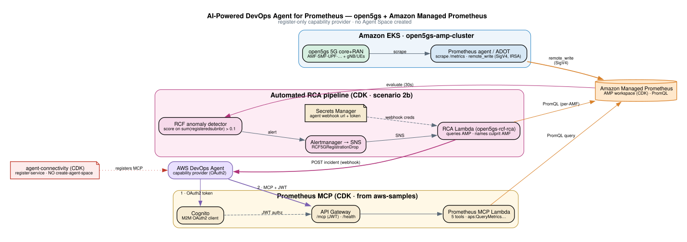

# 5G Anomaly Detection with AWS Managed Prometheus

Detect 5G network anomalies using **RCF (Random Cut Forest)** on Amazon Managed Prometheus, then **automatically run root-cause analysis** and hand it to the AWS DevOps Agent. A live open5gs 5G core on EKS generates real registration/session metrics; RCF learns the baseline and fires when infrastructure faults cause subscriber drops; an RCA Lambda correlates the drop to the culprit AMF and — once the DevOps Agent webhook is wired — forwards the incident to it (otherwise it logs the root cause to CloudWatch).

## What It Does

```
1000 UEs → 100 gNBs → 2 AMFs → SMF → 4 UPFs   (open5gs on EKS)
                         │ metrics (remote_write, SigV4)
                         ▼
              Amazon Managed Prometheus (AMP)
                         │ RCF anomaly detection (score > 0.1)
                         ▼
          RCF5GRegistrationDrop alert → AMP Alertmanager → SNS
                                                            │
                                                            ▼
                        RCA Lambda  (queries AMP, names the culprit AMF)
                                                            │
                          ┌─────────────────────────────────┴───────────────┐
                          ▼                                                   ▼
              DevOps Agent webhook                          (or logs the RCA to CloudWatch
              (autonomous investigation)                     if no webhook is configured)
```

**Demo scenario**: a bad config push crashes AMF1 → ~500 users (TAC=1) lose registration → the RCF score spikes → the `RCF5GRegistrationDrop` alert fires → the RCA Lambda identifies AMF1 as the crash-looping culprit and (when its webhook is wired) forwards the incident to the DevOps Agent. AMF2 (the other ~500 users) is unaffected.

## Architecture



## RCF Data Flow


## Deploy

### Prerequisites
- AWS CLI configured with a profile (account with EKS, AMP, SageMaker permissions)
- Node.js 18+, CDK CLI (`npm install -g aws-cdk`)
- kubectl, eksctl, Helm 3

The `deploy/` scripts are numbered in run order:

### 1. CDK — AMP + RCA pipeline + MCP + Notebook
```bash
export AWS_PROFILE=your-profile
./deploy/10-deploy-cdk.sh      # or: cd cdk && npm install && cdk bootstrap && cdk deploy --all --require-approval never
```
Creates: AMP workspace, RCF anomaly detector, alert rules, **the automated RCA pipeline** (SNS topic + RCA Lambda + Alertmanager routing + the DevOps Agent webhook secret), Prometheus MCP (Lambda/API GW/Cognito), and the SageMaker Notebook.

### 2. (Optional) Register the MCP with the DevOps Agent
```bash
./deploy/20-register-agent.sh
```
Registers the Prometheus MCP (API Gateway) as a DevOps Agent capability provider (OAuth2, **register-only** — reads the Cognito secret at runtime, never creates an Agent Space). Skip if you aren't using the DevOps Agent.

### 3. EKS + Prometheus
```bash
./deploy/30-eks-open5gs.sh
```
Creates: EKS cluster (3 nodes) + kube-prometheus-stack with remote_write to AMP.

### 4. 5G Core + 1000 UEs
```bash
./deploy/50-open5gs.sh
```
Creates: open5gs NFs (2 AMFs, 4 UPFs, shared CP), 1000 UERANSIM UEs across 4 DNNs, provisions subscribers.

### 5. Grant the notebook EKS access
```bash
./deploy/60-grant-notebook-eks-access.sh
```
Grants the SageMaker notebook's IAM role access to the EKS cluster. **Required** — without it the notebook's `kubectl` cells (fault injection) hang/fail.

### 6. (Optional) Verify + wire the DevOps Agent webhook
```bash
./deploy/40-verify-amp.sh              # checks metrics land in AMP + the agent MCP path works
./deploy/70-wire-agent-webhook.sh      # after creating a DevOps Agent Space: sets the webhook URL + token (entered hidden)
```
Until the webhook is wired the RCA Lambda still runs and **logs** the root cause to CloudWatch. See [Automated RCA → DevOps Agent](#automated-rca--devops-agent).

### 7. Open the Demo Notebook
Go to **SageMaker → Notebook Instances → open5gs-rcf-anomaly-demo → Open Jupyter** and run `rcf-anomaly-detection-demo.ipynb`:
1. Verify baseline (1000 UEs registered, RCF score = 0)
2. Inject fault (bad config → AMF1 crashes)
3. Observe anomaly (RCF score spikes, ~500 users drop)
4. Root-cause analysis (correlate with pod restarts)
5. Recovery (fix config → users re-register)

## Automated RCA → DevOps Agent

When registration drops, the RCF score crosses 0.1 and the `RCF5GRegistrationDrop` alert fires. From there the pipeline runs with no human in the loop:

```
RCF5GRegistrationDrop (score > 0.1, 30s eval)
  → AMP Alertmanager → SNS topic (open5gs-rcf-rca-trigger)
    → RCA Lambda (open5gs-rcf-rca): queries AMP for per-AMF registration + pod restarts,
      identifies the down / crash-looping AMF, builds a root-cause summary
      → POSTs an incident to the DevOps Agent webhook   (Authorization: Bearer <token>)
        └─ if no webhook is configured: logs the RCA to CloudWatch instead
```

### Wiring the DevOps Agent webhook
The webhook URL + token live in a **Secrets Manager secret** (`open5gs/devops-agent/webhook`) that the Lambda reads **at runtime** — so you fill it in after creating the Agent Space, with no code change and no redeploy:

- **Script (repeatable):** `./deploy/70-wire-agent-webhook.sh` — prompts for the URL and token (token entered hidden and written via a `0600` temp file, so it never lands in shell history or `ps`), then optionally fires a test alert and shows the POST result.
- **Console (one-off):** Secrets Manager → `open5gs/devops-agent/webhook` → *Retrieve secret value → Edit* → set `url` and `token` → Save.

Rotating the token is the same action (re-run the script or edit the secret); the Lambda picks up the new value on the next alert.

> **Why the Agent Space isn't in CDK:** activating the DevOps Agent and creating the Agent Space are account-level, console/identity-scoped actions with no CloudFormation support, so they're intentionally left to the operator. CDK owns the reproducible plumbing (AMP, RCF, SNS, Lambda, and the empty webhook secret); the human supplies only the webhook value.

## Quick Fault Injection (CLI)

```bash
# Break AMF1 (~500 TAC=1 users lose service; AMF2 unaffected)
./manifests/fault-inject-amf1.sh break

# The RCF alert fires → the RCA Lambda names AMF1 as the culprit. Watch it:
#   aws logs tail /aws/lambda/open5gs-rcf-rca --follow          (AWS CLI v2)
# Or check the score:
#   anomaly_detector:score{alias="5g-registered-subscribers"} > 0.1

# Fix it (restores config + restarts the TAC=1 gNBs to re-register)
./manifests/fault-inject-amf1.sh fix
```

## Components

| Layer | Components |
|---|---|
| **RAN** | 100 gNBs (UERANSIM StatefulSets, 10 UEs each = 1000 UEs) |
| **Core** | 2 AMFs (TAC partitioned), SMF, 4 UPFs, NRF/AUSF/UDM/UDR/PCF/NSSF/BSF |
| **Monitoring** | kube-prometheus-stack → remote_write (SigV4/IRSA) → AMP |
| **Detection** | RCF anomaly detector on `sum(fivegs_amffunction_rm_registeredsubnbr)` |
| **Automated RCA** | RCF alert → Alertmanager → SNS → RCA Lambda → DevOps Agent webhook (URL/token in Secrets Manager) |
| **Access** | Prometheus MCP (OAuth2/API GW) for the DevOps Agent; SageMaker Notebook for humans |

## Teardown

```bash
kubectl delete -f manifests/ueransim-multi.yaml
kubectl delete -f manifests/open5gs-core-multi.yaml
eksctl delete cluster --name open5gs-amp-cluster    # deletes the EKS cluster + nodegroup
cd cdk && cdk destroy --all                          # removes AMP, RCA pipeline (SNS/Lambda/secret), MCP, notebook
```

## Docs
- [`docs/CONTEXT.md`](docs/CONTEXT.md) — live resource IDs, critical fixes, resume checklist
- [`docs/DEMO-RUNBOOK.md`](docs/DEMO-RUNBOOK.md) — step-by-step demo with correlation queries
- [`setup_guide.md`](setup_guide.md) — detailed deploy/verify/troubleshoot guide
