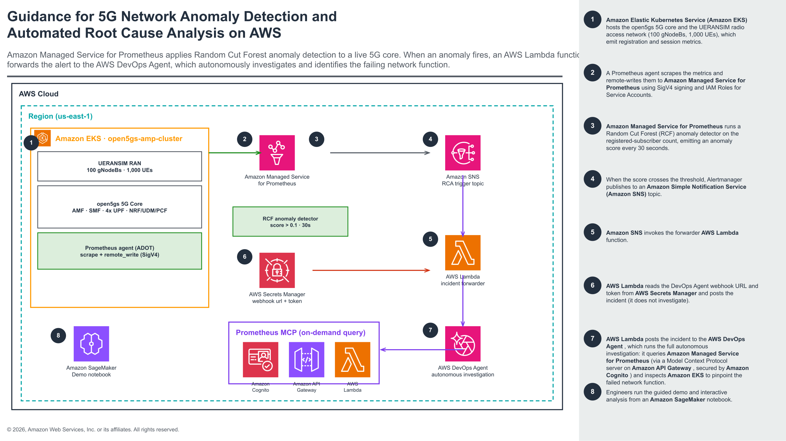
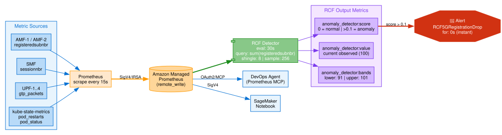

# Guidance for 5G Network Anomaly Detection and Automated Root-Cause Analysis with Amazon Managed Prometheus and the AWS DevOps Agent

## Table of Contents

- [Overview](#overview)
  - [Architecture](#architecture)
  - [How it works](#how-it-works)
  - [Cost](#cost)
  - [AWS services in this Guidance](#aws-services-in-this-guidance)
- [Prerequisites](#prerequisites)
  - [Operating system](#operating-system)
  - [Tools](#tools)
  - [AWS account requirements](#aws-account-requirements)
  - [Supported regions](#supported-regions)
- [Deployment Steps](#deployment-steps)
- [Deployment Validation](#deployment-validation)
- [Running the Guidance](#running-the-guidance)
- [Next Steps](#next-steps)
- [Cleanup](#cleanup)
- [FAQ and Known Issues](#faq-and-known-issues)
- [Notices](#notices)
- [Authors](#authors)

## Overview

This Guidance detects anomalies in a live **5G mobile core network** using **Random Cut Forest (RCF)** anomaly detection on **Amazon Managed Prometheus (AMP)**, then **automatically triggers the AWS DevOps Agent** to investigate the incident autonomously.

A real [open5gs](https://open5gs.org/) 5G core (2 AMFs, 1 SMF, 4 UPFs, and supporting network functions) with **1,000 simulated subscribers** (UERANSIM) runs on Amazon EKS and emits registration and session metrics. Prometheus remote-writes those metrics to AMP using SigV4 and IRSA. An RCF detector learns the normal baseline and fires an alert when an infrastructure fault causes a subscriber drop. The alert flows through AMP Alertmanager to Amazon SNS to a forwarder Lambda function, which posts the incident to the DevOps Agent webhook — and the **AWS DevOps Agent then performs the entire investigation itself**, querying metrics and inspecting the cluster to identify the failing network function.

**Use case:** SRE and NOC automation for telco and other high-scale workloads — turning a raw anomaly signal into an attributed, actionable incident with no human in the loop.

**Demo scenario:** a bad config push crashes AMF1 → ~500 subscribers (TAC=1) lose registration → the RCF score spikes → the `RCF5GRegistrationDrop` alert fires → the forwarder Lambda posts the incident to the DevOps Agent, which investigates and identifies AMF1 as the crash-looping culprit. AMF2 (the other ~500 subscribers) is unaffected.

### Architecture



> The editable source is [`docs/diagrams/5g-rcf-architecture-guidance.pptx`](docs/diagrams/5g-rcf-architecture-guidance.pptx) (AWS Guidance template format); a self-contained vector version is [`docs/diagrams/5g-rcf-architecture-guidance.svg`](docs/diagrams/5g-rcf-architecture-guidance.svg).

### How it works

1. **Amazon EKS** hosts the open5gs 5G core network functions and the UERANSIM RAN (100 gNodeBs, 1,000 UEs), which expose Prometheus metrics on port 9090.
2. A **Prometheus agent** (kube-prometheus-stack) scrapes them and remote-writes to AMP over SigV4, via an IRSA service account.
3. An AMP **RCF anomaly detector** scores `sum(fivegs_amffunction_rm_registeredsubnbr)` every 30 seconds.
4. When the score crosses `0.1`, the `RCF5GRegistrationDrop` alert fires and AMP **Alertmanager** publishes to the **Amazon SNS** topic `open5gs-rcf-alert-trigger`.
5. **Amazon SNS** invokes the forwarder **AWS Lambda** function (`open5gs-rcf-agent-forwarder`).
6. The Lambda reads the DevOps Agent webhook URL and token from **AWS Secrets Manager** at runtime and **POSTs the incident** (HMAC or API-key auth). It does not query metrics or derive root cause.
7. The **AWS DevOps Agent** performs the **entire autonomous investigation** — querying AMP through the OAuth2-secured **Prometheus MCP** (API Gateway + Amazon Cognito + Lambda) and inspecting the EKS workload — to pinpoint the failing network function.
8. An **Amazon SageMaker** notebook drives the end-to-end demo: baseline → wire the agent → inject the fault → observe the anomaly → watch the automated investigation → recover.



### Cost

You are responsible for the cost of the AWS services used while running this Guidance. As of **August 2026**, the estimated cost for running this Guidance with the default settings in the **US East (N. Virginia)** Region, running continuously for one month, is approximately **$600 USD/month**. Costs drop substantially when the EKS nodegroup is scaled to zero between demos.

We recommend creating a [budget](https://docs.aws.amazon.com/cost-management/latest/userguide/budgets-managing-costs.html) and using the [AWS Pricing Calculator](https://calculator.aws) for the specific configuration and Region you deploy.

| AWS service | Dimension | Estimated cost/month (USD) |
|---|---|---|
| Amazon EKS | 1 cluster control plane ($0.10/hr) | $73 |
| Amazon EC2 | 3 × `t3.xlarge` worker nodes | $365 |
| Amazon VPC | 1 NAT gateway + data processing | $38 |
| Amazon EBS | ~200 GB gp3 (nodes + PVCs) | $20 |
| Amazon Managed Prometheus | metric ingestion + storage + queries | ~$40 |
| Amazon SageMaker | 1 `ml.t3.medium` notebook (if always on) | $35 |
| Lambda + SNS + API Gateway + Cognito + Secrets Manager | low-volume control plane | ~$5 |
| **Total** | | **~$576** |

> These are estimates for illustration only and will vary with usage, Region, and time. Use the AWS Pricing Calculator for an accurate figure.

### AWS services in this Guidance

| Service | Role |
|---|---|
| Amazon EKS | Runs the open5gs 5G core + UERANSIM (RAN/UE simulator) |
| Amazon Managed Prometheus (AMP) | Metric store, RCF anomaly detector, alert rules, Alertmanager |
| Amazon SNS | Delivers the RCF alert to the forwarder Lambda |
| AWS Lambda | Forwards the incident to the DevOps Agent webhook; Prometheus MCP server |
| Amazon API Gateway + Amazon Cognito | OAuth2-secured MCP endpoint for the DevOps Agent |
| AWS Secrets Manager | Stores the DevOps Agent webhook URL + token (read at runtime) |
| Amazon SageMaker | Demo notebook |
| AWS DevOps Agent | Autonomous incident investigation (external integration) |

## Prerequisites

### Operating system

These instructions are written for **macOS or Linux** with a Bash shell.

### Tools

- **AWS CLI v2**, configured with a named profile. All scripts honor `AWS_PROFILE` and default to `default` if it is not set — export your own profile before running:
  ```bash
  export AWS_PROFILE=your-profile        # no profile is hardcoded anywhere
  ```
- **Node.js 18+**. The AWS CDK CLI is installed locally in `cdk/node_modules` and invoked via `npx cdk` throughout — a global `aws-cdk` install is optional. If you want it globally: `npm install -g aws-cdk`.
- **kubectl**, **eksctl**, **Helm 3**, **Python 3.10+**

### AWS account requirements

- An AWS account with permissions to create Amazon EKS, AMP, SageMaker, Lambda, SNS, API Gateway, Cognito, Secrets Manager, and IAM resources.
- CDK bootstrapped in your account/Region: `cd cdk && npx cdk bootstrap`.
- **AWS DevOps Agent (only for the automated-investigation path — optional):**
  1. **Enable the AWS DevOps Agent** in the console and **create an Agent Space** (an account-level, console/identity-scoped action with no CloudFormation support — it is intentionally left to the operator).
  2. **Generate a webhook** in the Agent Space (choose **HMAC** — recommended — or **API key** auth) and copy the URL + secret.
  3. To register the Prometheus MCP as a capability provider (`deploy/20-register-agent.sh`), your account must be **allow-listed for the `devops-agent register-service` API**, which is currently a **gated preview**. If it is not, you will see:
     ```
     AccessDeniedException … Account <id> is not authorized. Only external accounts and exempted accounts are allowed at this time.
     ```
     This step is **optional and non-blocking** — `deploy/20` detects this and skips gracefully. The DevOps Agent is still *triggered* by the webhook; the MCP registration only lets it *query* AMP during an investigation.

### Supported regions

This Guidance defaults to **`us-east-1`** and is Region-overridable (`export AWS_REGION=...`). Use a Region where all listed services — including AMP, SageMaker, and (if used) the AWS DevOps Agent — are available.

## Deployment Steps

The `deploy/` scripts are numbered in run order. Set your profile first: `export AWS_PROFILE=your-profile`.

```bash
# 1. Control plane — AMP + RCF + automated RCA pipeline + Prometheus MCP + SageMaker notebook (CDK)
./deploy/10-deploy-cdk.sh          # or: cd cdk && npm install && npx cdk bootstrap && npx cdk deploy --all --require-approval never

# 2. (Optional) Register the Prometheus MCP with the AWS DevOps Agent (register-only; see Prerequisites)
./deploy/20-register-agent.sh      # skips gracefully if the account isn't allow-listed

# 3. EKS cluster (3 nodes) + kube-prometheus-stack remote-writing to AMP
./deploy/30-eks-open5gs.sh

# 4. open5gs 5G core + 1000 UERANSIM subscribers
./deploy/50-open5gs.sh

# 5. Grant the SageMaker notebook IAM role access to the EKS cluster (required for the notebook's kubectl cells)
./deploy/60-grant-notebook-eks-access.sh
```

Step 1 creates: the AMP workspace, RCF anomaly detector, alert rules, the alert-forwarding pipeline (SNS topic + forwarder Lambda + Alertmanager routing + the empty DevOps Agent webhook secret), the Prometheus MCP (Lambda / API Gateway / Cognito), and the SageMaker notebook.

## Deployment Validation

```bash
# CloudFormation stacks are CREATE/UPDATE_COMPLETE
aws cloudformation describe-stacks --query "Stacks[].StackName" --output text

# Metrics are landing in AMP (direct SigV4). Expect fivegs_amffunction_rm_registeredsubnbr and session counts.
./deploy/40-verify-amp.sh
```
- In the EKS cluster: `kubectl get pods -n open5gs` shows the 5G network functions Running, and `kubectl get pods -n monitoring` shows Prometheus Running.
- In the console: **Amazon Managed Prometheus** shows the workspace and the `5g-registered-subscribers` anomaly detector; **SageMaker → Notebook instances** shows `open5gs-rcf-anomaly-demo` **InService**.

## Running the Guidance

> **Important — wait ~2 hours after `deploy/50` finishes before injecting the fault.** The RCF anomaly detector needs a stable training baseline before its score reliably crosses the alert threshold. With the default configuration (`shingleSize=8`, `sampleSize=256`, evaluation every 30s), it needs ≈128 minutes of steady 1000-UE registration data. If you inject the fault too early, AMF1 will crash-loop and ~500 UEs will deregister exactly as expected, but the RCF score may stay below `0.1` and the alert will not fire. See the FAQ for how to verify the SNS → Lambda pipeline without waiting.

Open **SageMaker → Notebook Instances → `open5gs-rcf-anomaly-demo` → Open Jupyter** and run `rcf-anomaly-detection-demo.ipynb`. The notebook is ordered so the DevOps Agent is wired **before** the fault:

1. **Step 1** — verify the healthy baseline (1000 subscribers registered, RCF score 0).
2. **Step 2 — Set up & wire the AWS DevOps Agent (before the fault).** Follow the in-notebook guidance to create the Agent Space, add the MCP capability, and generate a webhook. Paste the **webhook URL + secret** into the placeholder cell, set the auth type (`hmac` or `bearer`), and run the **wiring cell** — it stores `{url, token, auth}` in Secrets Manager (`open5gs/devops-agent/webhook`), which the forwarder Lambda reads at runtime.
3. **Step 3** — inject the fault (bad config → AMF1 CrashLoopBackOff → ~500 subscribers drop).
4. **Step 4** — observe the anomaly (the RCF score spikes; use the range query in UTC to catch the single-cycle spike).
5. **Step 5 — the DevOps Agent investigates automatically.** The RCF alert → SNS → forwarder Lambda → your webhook, and the agent runs the full autonomous investigation. Open **Agent Space → Incidents** to watch it; the notebook also confirms the webhook is wired and prints the ground-truth signals so you can compare the agent's conclusion.
6. **Step 6** — recover (restore config, subscribers re-register to 1000).

### Quick fault injection (CLI alternative)

```bash
# Break AMF1 (~500 TAC=1 subscribers lose service; AMF2 unaffected)
./manifests/fault-inject-amf1.sh break

# The RCF alert fires -> the forwarder Lambda POSTs the incident to the DevOps Agent webhook. Watch the Lambda:
#   aws logs filter-log-events --log-group-name /aws/lambda/open5gs-rcf-agent-forwarder --start-time <epoch-ms>
#   (look for "Agent webhook status: 2xx")

# Fix it (restores config + restarts the TAC=1 gNBs to re-register)
./manifests/fault-inject-amf1.sh fix
```

If no webhook is configured, the forwarder Lambda logs the alert to CloudWatch and forwards nothing. See [`docs/DEMO-RUNBOOK.md`](docs/DEMO-RUNBOOK.md) for the full step-by-step walkthrough and the signals the agent correlates.

## Next Steps

- Wire the DevOps Agent webhook (Step 2 / `deploy/70-wire-agent-webhook.sh`) once your Agent Space exists, to see the fully autonomous investigation.
- Add more RCF detectors (session count per UPF, PDU-session establishment rate) for richer anomaly coverage.
- Extend the forwarder Lambda to attach additional context (recent ConfigMap changes, node conditions) to the incident payload it posts.
- Adapt the pattern to your own workload: point Prometheus/AMP at your metrics, define an RCF detector on your key SLI, and reuse the SNS → Lambda → DevOps Agent bridge.

## Cleanup

```bash
# 5G workload + UE simulators
kubectl delete -f manifests/ueransim-multi.yaml
kubectl delete -f manifests/open5gs-core-multi.yaml

# EKS cluster + nodegroup
eksctl delete cluster --name open5gs-amp-cluster

# All CDK resources (AMP, RCA pipeline SNS/Lambda/secret, MCP, notebook)
cd cdk && npx cdk destroy --all
```

## FAQ and Known Issues

- **`deploy/20` fails with `AccessDeniedException … Only external and exempted accounts are allowed`.** The `devops-agent register-service` API is a gated preview; your account isn't allow-listed. This step is optional and the script now skips it gracefully — the webhook path still works. Request allow-listing to enable it later. See [Prerequisites](#aws-account-requirements).
- **The RCF alert doesn't fire even though AMF1 crashed and ~500 UEs deregistered.** The RCF detector needs enough training data to be confident that the drop is anomalous. Wait **≈2 hours after `deploy/50` finishes** for the model to accumulate 128+ minutes of stable baseline before injecting the fault. To validate the SNS → forwarder Lambda → webhook pipeline without waiting, publish a synthetic Alertmanager message directly to the topic:
  ```bash
  TOPIC=$(aws sns list-topics --query "Topics[?contains(TopicArn,'open5gs-rcf-alert-trigger')].TopicArn" --output text)
  aws sns publish --topic-arn "$TOPIC" --subject "RCF 5G registration anomaly" \
    --message '{"receiver":"agent-forwarder-sns","status":"firing","alerts":[{"status":"firing","labels":{"alertname":"RCF5GRegistrationDrop","alias":"5g-registered-subscribers"},"annotations":{"summary":"synthetic test"}}]}'
  # then check the Lambda log:
  aws logs filter-log-events --log-group-name /aws/lambda/open5gs-rcf-agent-forwarder --start-time $(($(date +%s)*1000 - 60000)) --query 'events[].message' --output text
  ```
- **The RCF score reads 0 right after the fault.** Even after enough training, the score spikes for a single ~30-second cycle and then the model adapts. Query the score over a **time range in UTC** (as the notebook does) rather than an instant query.
- **The EKS nodegroup scaled to 0 / `kubectl` shows no nodes.** Idle-automation may scale the nodegroup to zero. Re-scale: `aws eks update-nodegroup-config --cluster-name open5gs-amp-cluster --nodegroup-name ng-1 --scaling-config minSize=2,maxSize=3,desiredSize=2`.

## Notices

Customers are responsible for making their own independent assessment of the information in this Guidance. This Guidance: (a) is for informational purposes only, (b) represents AWS current product offerings and practices, which are subject to change without notice, and (c) does not create any commitments or assurances from AWS and its affiliates, suppliers, or licensors. AWS products or services are provided "as is" without warranties, representations, or conditions of any kind, whether express or implied. AWS responsibilities and liabilities to its customers are controlled by AWS agreements, and this Guidance is not part of, nor does it modify, any agreement between AWS and its customers.

### License and third-party components

The code in this repository is licensed under the [MIT-0 License](LICENSE).

This Guidance **deploys** third-party open source software to demonstrate the pattern — notably **Open5GS** and **UERANSIM** (both **AGPL-3.0**, UERANSIM also offering a commercial license) and **MongoDB Community** (**SSPL**). That software is pulled as container images at deployment time and is neither redistributed nor linked by this repository. Review [`NOTICE.md`](NOTICE.md) for the full attribution list and licensing notes before any production or commercial use. The anomaly-detection and DevOps Agent pattern itself is not tied to these components — it works with any Prometheus-compatible metric source.

## Authors

- Mohamed Sherif

## Related documentation

- [`docs/DEMO-RUNBOOK.md`](docs/DEMO-RUNBOOK.md) — step-by-step demo with correlation queries
- [`setup_guide.md`](setup_guide.md) — detailed deploy / verify / troubleshoot guide
- [`docs/CONTEXT.md`](docs/CONTEXT.md) — internal engineering reference (not required for deployment)
